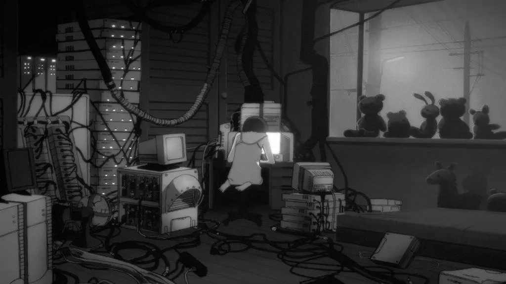

# Dots

This is where I tweak config files till 4am like a goblin. It's pretty cozy in here.



## My Cursed Tools

- **[claude](https://code.claude.com/)**
- **[fish](https://fishshell.com/)**
- **[gh-dash](https://www.gh-dash.dev/)**
- **[homebrew](https://brew.sh/)**
- **[neovim](https://neovim.io/)**
- **[pi](https://github.com/badlogic/pi-mono)**
- **[wezterm](https://wezterm.org/index.html)**
- **[stow](https://www.gnu.org/software/stow/)**
- **[SwiftBar](https://github.com/swiftbar/SwiftBar)**
- **[yazi](https://yazi-rs.github.io/)**

## Setup

```bash
bash scripts/bootstrap.sh
```

## Markdown link previews

In Neovim, rest the cursor on a Markdown link label, URL, or YouTube iframe URL
for 200 ms to preview its image. The first visit also needs time to fetch the page
and image. Webpages use Open Graph images with a
Twitter image fallback; YouTube watch, short, live, and embed URLs use thumbnails.
Pages without an image show their title instead. Broken images also fall back to
the title with an unavailable message. Moving away closes the popup.
Markdown image syntax keeps using Snacks' existing image hover.

The local module `nvim/.config/nvim/lua/config/link-preview.lua` exposes
`setup({ delay = 200, ttl = 3600, max_width = 60, max_height = 20 })`.
It uses asynchronous curl requests and Neovim's HTML Tree-sitter parser for
metadata, and Snacks/WezTerm for image rendering. Hovering fetches the URL and its
preview image; metadata is cached in memory and in a per-user directory under
`$TMPDIR` (or `/tmp`) for an hour, failures for a minute. The disk cache survives
Neovim restarts and holds at most 128 entries. Expired entries are ignored and
removed on access. `cache_dir`, `ttl`, `failure_ttl`, and `max_entries` are
configurable through `setup()`. Snacks maintains its own downloaded-image cache.
Private or fetch-blocked pages show an unavailable message. Reference-style
Markdown link labels are not currently resolved.

Offline checks: `nvim --headless -u NONE -l tests/link_preview.lua` (requires
installed HTML and Markdown Tree-sitter parsers). Actual image rendering requires
a graphics-capable terminal.
